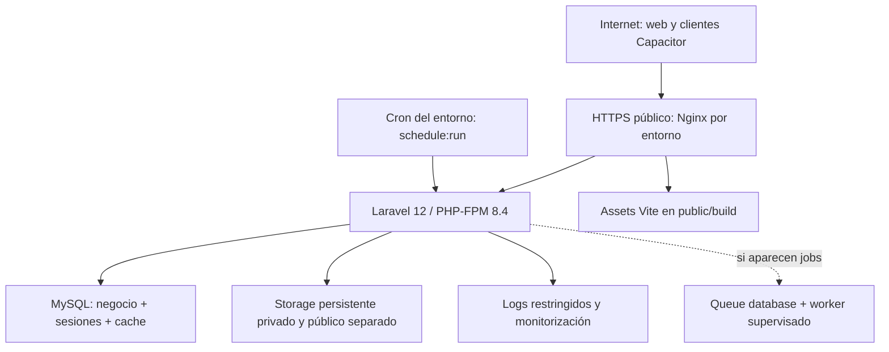

# Asistencia MDM — Production/Cloud Readiness

## A. Executive status

Fecha: 2026-09-19. Fase: RELEASE-0-PRE. Marca: Medical Life.
HEAD auditado: `bd4b4f1d49203e9bcc82f1f04d731c697e933241`.
Rama: `phase/14-biometric-engine-selection`; el nombre no autoriza Phase14.

**Discovery: PASS. Despliegue staging/production: NO-GO.** Readiness aproximado: **20% (4/20 gates cerrados)** según sección S; no es porcentaje de implementación ni disponibilidad. Infraestructura remota validada: ninguna. No se leyó `.env`, registro privado de testers ni datos de la base. No se ejecutaron Artisan, migraciones, tests, deploy, backup, SSH, DNS, APK ni operaciones sobre teléfonos. Esta fase sólo añade este documento y `server-input.md`.

Base de trabajo: 14 tracked modified, 0 deleted, 63 untracked, 0 staged, 77 rutas únicas pendientes; snapshot SHA256 de las 77 antes de editar y comparación al cierre. Las propuestas operativas siguientes no son configuración aplicada.

**Diferencia HEAD / working tree:** `/ready`, ReadinessProbe/Controller/test, scripts Linux de deployment, `.env.beta.example`, varios ajustes backend/config/scheduler, YAML y desactivación de scripts PowerShell todavía son cambios pendientes. Un checkout de HEAD no contiene todo lo observado. Es obligatorio consolidar y validar un artefacto cerrado antes de desplegar; no empaquetar el working tree local completo. CP-C06 y UX-01 sí están consolidados. Laravel 12, guard fortia_mock y hardening Sanctum ya no son hallazgos pendientes; no se detectó regresión estática.

### Inventario de deployment y precedencia

Clasificación por contenido observado, sin ejecutar scripts. CURRENT significa vigente para su alcance indicado, no instalado en cloud.

| Archivo | Clasificación | Uso y limitación actual |
|---|---|---|
| `.gitlab-ci.yml` | REUSABLE / NEEDS-UPDATE | Plantilla pendiente Linux beta: validate/test/build/package/deploy_beta/healthcheck. No jobs staging/production, imagen/toolchain fijada ni pipeline remoto acreditado. |
| `scripts/deploy_production.ps1`, `scripts/deploy_qa.ps1` | SUPERSEDED | Working tree aborta inmediatamente. Preservar esa retirada; nunca reutilizar el deploy legacy de HEAD por accidente. |
| `scripts/deployment/assert-beta.php` | CURRENT beta / NEEDS-UPDATE | Exige InternalBeta, DB de nombre beta fijo, registry no vacío, discos no servibles, SYBI/cleanup apagados, proxy sin wildcard. No sirve como precheck production; tampoco demuestra por sí solo todo el contrato TLS/CORS/DB. |
| `scripts/deployment/ci-deploy-beta.sh` | REUSABLE / NEEDS-UPDATE | Ref/tag/environment beta protegidos, SSH host key fijada, allowlist de ruta beta, hash local. Falta verificación del hash del paquete recibido en host y contrato staging/production. |
| `scripts/deployment/deploy-beta.sh` | REUSABLE / NEEDS-UPDATE | Releases + symlink, flock y hook backup requerido; migra antes del switch. Sin mantenimiento/drenaje, restart FPM/worker, smoke candidato ni rollback automático al fallar health. |
| `scripts/deployment/healthcheck.sh` | REUSABLE | Sólo HTTPS, status 200 exacto en up/ready, sin redirects ni TLS insecure; timeout conexión 10 s/total 30 s. No valida versión, payload, cola ni scheduler. |
| `docs/deployment/beta-server-readiness.md` | HISTORICAL / REUSABLE / NEEDS-UPDATE | Retener diseño Debian/Nginx; Laravel 11 y límites del checkpoint ya superados. |
| `docs/deployment/beta-server-installation.md` | HISTORICAL / REUSABLE / NEEDS-UPDATE | Diseño válido; ruta antigua difiere de scripts, worker era opcional, gates migraciones/cache requieren evidencia del artefacto actual. |
| `docs/deployment/branding-beta-baseline.md` | HISTORICAL / SUPERSEDED para nombre visible | Baseline de assets, no renombrar producto a Medical Life One. Prevalece `docs/product/asistencia-mdm-product-scope.md`. |
| `docs/deployment/domain-transition-runbook.md` | HISTORICAL / NEEDS-UPDATE | Principios de preservación reutilizables; builds, actores, inexistencia de B y falta de soporte de dominio son historia anterior a Build12/MD-02/CP-C06. No copiar sus selecciones de datos literalmente. |
| `docs/deployment/gitlab-deployment-discovery.md` | HISTORICAL | Auditoría del despliegue heredado; no receta para nuevo servidor. |
| `docs/deployment/gitlab-vending-plan.md` | REUSABLE / NEEDS-UPDATE | Gates/artefactos reutilizables; su tag propuesto no coincide con regex beta del YAML actual. |
| `docs/deployment/migration-inventory.txt` | CURRENT inventario / REUSABLE | 105 nombres contrastados con directorio; no equivale a aprobación productiva. |
| `docs/deployment/migrations-beta-classification.md` | REUSABLE / NEEDS-UPDATE | Clasificación de dominio beta; riesgos de upgrade actual en anexo de este documento. |
| `docs/deployment/phase13.10-server-input.txt` | SUPERSEDED para nuevo release | Usar `docs/release/server-input.md`, manteniendo el original histórico. |
| `docs/deployment/phase13.9-result.md` | HISTORICAL | Discovery previo, no servidor disponible. |
| `docs/deployment/phase13.9A-blockers.md` | HISTORICAL / parcialmente SUPERSEDED | Laravel, mock migration y fixture ya corregidos; no reabrirlos como fallos actuales. |
| `docs/deployment/phase13.9A-checkpoint.md` | HISTORICAL / SUPERSEDED | Consolidación ocurrió en commits separados; no stagear el inventario antiguo. |
| `docs/deployment/phase13.9A-implementation.md` | REUSABLE / NEEDS-UPDATE | Contratos beta útiles; versiones/builds y estado de consolidación cambiaron. |
| `docs/deployment/phase13.9A-result.md`, `phase13.9A.1-result.md` | HISTORICAL | Evidencia de pruebas en ese checkpoint, no prueba del cloud ni de production. |
| `docs/deployment/phase13.9A.1-staging-inventory.md` | SUPERSEDED | No representa el fileset pendiente actual. |
| `tools/local-field-https/`, docs de LAN, CA/config local | LOCAL-ONLY | No trasladar IPs, CA privada, configuración Apache local ni secretos al artefacto. |

## B. Architecture

Se mantiene el monolito Laravel 12, Vue/Inertia y assets Vite. Nginx + PHP-FPM sigue el diseño previo; no se elige un servidor distinto por preferencia. Apache + FPM es alternativa sólo si operaciones lo requiere y valida front controller, TLS, permisos y denegación de privados. Apache local no prueba arquitectura cloud.

Dos entornos independientes. Propuesta inicial: una VM por entorno, MySQL local a cada VM para carga pequeña; DB gestionada privada también posible según input, con TLS y permisos. No HA certificada, no microservicios, no Redis obligatorio, sin servicio Node en runtime ni SSR observado en scripts web. No capacidad prometida para una flota determinada sin benchmark.

## C. Environments

| Contrato | STAGING | PRODUCTION |
|---|---|---|
| APP_ENV | `staging`, ensayo productivo | `production` |
| APP_DEBUG | false | false |
| APP_KEY | Propia, custodia staging | Propia, diferente de staging/local |
| Web/API | Un origen HTTPS propio, raíz `/` | Otro origen HTTPS propio, raíz `/` |
| MySQL | STAGING_DB y usuarios propios | PRODUCTION_DB y usuarios propios |
| Storage/logs/cache/session | Rutas, prefijos y cookies propios | Rutas, prefijos y cookies propios |
| Datos | Sintéticos autorizados, sin copiar PII productiva | Sólo datos autorizados y contratos aprobados |
| Mail | Sandbox/allowlist de destinatarios | Remitente/proveedor verificado |
| Integraciones | Apagadas o sandbox explícito | Activación individual tras contrato |

**Incompatibilidad actual importante:** `InternalBeta::simulationAllowed()` sólo permite local/testing o beta habilitada con debug=false. `DeviceIdentityService` y el proveedor OTP usan ese gate. `APP_ENV=staging` no habilita onboarding/challenge personal actual; `production` tampoco. Es fail-closed correcto, pendiente PROD-IDENTITY-01. No renombrar staging a local ni habilitar simulación productiva para ocultar el bloqueo. Si se requiere probar temporalmente INTERNAL BETA, provisionar un entorno beta explícito y separado; no llamarlo ensayo de identidad productiva.

## D. Infrastructure requirements

Dimensionamiento **propuesto, no benchmark**, por entorno si aloja MySQL:

| Recurso | Mínimo inicial | Recomendado inicial |
|---|---|---|
| CPU | 2 vCPU | 4 vCPU |
| RAM | 4 GiB | 8 GiB |
| Disco | 60 GiB SSD | 100 GiB SSD; ampliar según evidencia/retención |
| Reserva | >=20% disco libre; control de inodos | Backups fuera del host; restore con espacio propio |

Linux Debian 13 amd64 mantiene el diseño existente; distribución soportada con PHP 8.4 disponible. Fijar parche/repositorio e imagen en instalación, no usar `latest`. Debian informa soporte completo hasta agosto de 2028 y LTS hasta junio de 2030 ([ciclo Debian](https://www.debian.org/releases/trixie/)). SO/DB en UTC, sincronización NTP vigilada: HMAC/challenges dependen del reloj. Firewall: HTTPS público; HTTP sólo ACME/redirección; SSH restringido a administrador/runner; MySQL sólo loopback o red privada autorizada.

Versiones **derivadas de manifests/locks**, no de `.env` ni del servidor:

| Componente | Evidencia efectiva | Contrato de instalación |
|---|---|---|
| PHP | composer.json `^8.4` | CLI y FPM 8.4.x con parche soportado, mismos módulos; consultar [soporte PHP](https://www.php.net/supported-versions.php) al provisionar |
| Laravel / Sanctum / Inertia PHP | lock 12.69.2 / 4.2.1 / 2.0.14 | Instalar lock, no composer update |
| Excel / PhpSpreadsheet | lock 3.1.70 / 1.30.6 | Módulos y memoria para import/export |
| Web Vue / Inertia Vue / Vite | lock 3.5.25 / 2.2.21 / 6.4.3 | npm ci; Vite acepta Node 18/20/>=22 según engine, no implica soporte vigente de esas ramas |
| Mobile Vue / Ionic / Vite / Capacitor | lock 3.5.42 / 9.0.2 / 8.2.2 / 7.6.9 | Vite exige Node ^20.19 o >=22.12; CLI Capacitor >=20 |
| Builder | Node 24 LTS propuesto, satisface ambos engines | Fijar imagen/parche/npm y verificar ambos locks en CI; [ciclo oficial Node](https://github.com/nodejs/Release) |
| Composer | 2.x; no versión exacta fijada por repo | Fijar versión en CI/host; check-platform-reqs --no-dev |
| MySQL | Sin pin en Composer | Propuesta 8.4 LTS, comprobar instalación/upgrade en esa versión; [modelo LTS MySQL](https://dev.mysql.com/doc/refman/8.4/en/mysql-releases.html) |

Host necesita Nginx/FPM, PHP CLI, Composer si se mantiene instalación vendor remota, cliente MySQL para backup/migración, Bash, tar, coreutils, flock, SSH/SCP, curl, herramienta ACME y CA públicas del SO. Git sólo en checkout CI o si se decide deploy por código; no obligatorio con tar inmutable. Node/npm sólo en builder (en host únicamente si se aprueba build allí). Java/SDK Android no pertenecen al servidor Web/API.

### Extensiones PHP

| Extensión | Clase | Evidencia |
|---|---|---|
| PDO + pdo_mysql | REQUIRED | config/database.php y DB MySQL |
| mbstring | REQUIRED | Laravel, prompts, CommonMark, ZipStream |
| openssl | REQUIRED | Laravel, cifrado, firma/challenge y HTTPS |
| curl | OPTIONAL en PHP; recomendado operativo | Guzzle admite transporte streams; no requisito ext-curl en paquetes production del lock. Binario curl sí requerido por healthcheck. |
| fileinfo | REQUIRED | Flysystem y sanitizador soporte |
| gd | REQUIRED | PhpSpreadsheet y SupportImageSanitizer; verificar JPEG/PNG/WebP compilados |
| intl | OPTIONAL | Polyfills presentes; mejora rendimiento, sin uso directo obligatorio encontrado |
| zip | REQUIRED | PhpSpreadsheet/importación XLSX |
| xml, dom, libxml, simplexml, xmlreader, xmlwriter | REQUIRED | PhpSpreadsheet y conversión HTML |
| bcmath | NOT USED como dependencia obligatoria | Sin llamadas directas ni require productivo; sugerencia de tooling no obliga runtime |
| ctype, filter, hash, iconv, json, pcre, session, tokenizer, zlib | REQUIRED | Unión require ext-* de composer.lock production |
| opcache | OPTIONAL funcional; recomendado operativo | FPM y rendimiento, invalidación/reload por release |
| pdo_sqlite/sqlite3 | OPTIONAL runtime; REQUIRED CI seguro | Tests aislados, no base operativa |
| redis / pcntl | OPTIONAL | Redis no seleccionado; pcntl relevante si se incorporan workers con timeout/señales |

No instalar todas las extensiones sugeridas históricamente sin distinguir requisitos. Verificar plataforma real con `composer check-platform-reqs --no-dev` en candidato, sin ejecutar aquí.

### Web server

Document root exclusivo `<DEPLOY_PATH>/current/public`; assets estáticos en `public/build`, Laravel en `public/index.php`. Nginx: resolución tipo `try_files` al front controller; sólo ejecutar ese PHP mediante FPM y ruta real del release. Apache: reglas equivalentes de front controller y denegaciones, no copiar vhost LAN. Rechazar host desconocido, dotfiles (excepto ACME), backups/configs, rutas internas y PHP subido. Nunca alias de storage privado.

Límites propuestos: PHP upload_max_filesize=5M, post_max_size=8M y request body web=8 MiB para carga individual. Soporte admite 5 MiB por evidencia, máximo 5 por ticket, no cinco archivos en una petición obligatoria; upload binario o multipart en SupportEvidenceController. Import empleados máximo 5120 KiB. Validar rechazo 413 y overhead sin ampliar límites de dominio. Timeouts iniciales HTTP/FPM acotados (por ejemplo 60 s), ajustar con importación/exportación sintética; no garantizar que todos los imports caben ni usar timeout ilimitado. Memory_limit y tamaño pool FPM requieren medición con imágenes de hasta 12 MP.

Headers propuestos: nosniff, política referrer restrictiva, frame policy compatible con Inertia; CSP primero en report-only y prueba de assets/mapas, no bloquear recursos sin inventario. HSTS según J. Permitir Authorization/HMAC y encabezados necesarios sin registrarlos. Pasar HTTPS real a FPM; si termina TLS antes del host, aplicar contrato de proxies en J, no confiar en X-Forwarded-* de Internet.

## E. Configuration matrix

La matriz es objetivo, **no plantilla ya desplegable**. Placeholders `.example.test` son exclusivamente ejemplos sintéticos, no dominios propuestos ni resolubles.

| Variable / configuración | Staging | Production / límite |
|---|---|---|
| APP_NAME | Asistencia MDM | Asistencia MDM |
| APP_ENV / APP_DEBUG | staging / false | production / false |
| APP_URL | https://staging.example.test | https://production.example.test |
| APP_KEY | Secreto exclusivo | Otro secreto exclusivo |
| APP_TIMEZONE / OPERATIONS_STORAGE_TIMEZONE | UTC / UTC | UTC / UTC |
| OPERATIONS_TIMEZONE | America/Mexico_City, confirmar negocio | Mismo criterio de presentación aprobado |
| APP_BASE_PATH / VITE_APP_BASE_PATH | Vacíos, app en raíz | Vacíos |
| API_BASE_URL / VITE_API_BASE_URL | Vacíos: solicitudes relativas | Vacíos en build limpio, no heredar .env local |
| ASSET_URL | Vacío para mismo origen | Vacío salvo CDN aprobado |
| DB_CONNECTION | mysql | mysql |
| DB_HOST / DB_PORT / DB_DATABASE / DB_USERNAME | Input STAGING_DB/runtime | Input PRODUCTION_DB/runtime |
| DB_PASSWORD / DB_URL | Secreto; DB_URL vacío si se usan campos | Evitar override oculto de URL; jamás root |
| DB_CHARSET / DB_COLLATION | utf8mb4 / utf8mb4_unicode_ci | Igual |
| SESSION_DRIVER / CACHE_STORE | database / database | database / database inicialmente |
| SESSION_COOKIE / CACHE_PREFIX | Exclusivos staging | Distintos production |
| SESSION_DOMAIN / SESSION_PATH | null (host-only) / `/` | null (host-only) / `/` |
| SESSION_SECURE_COOKIE / SESSION_HTTP_ONLY | true / true | true / true |
| SESSION_ENCRYPT / SESSION_SAME_SITE | true / lax | true / lax |
| SANCTUM_STATEFUL_DOMAINS | staging.example.test | production.example.test; host[:puerto], sin scheme/ruta/* |
| VENDING_CORS_ALLOWED_ORIGINS | https://localhost para terminal Android; lista exacta revisada | Origen exacto aprobado; no añadir dominios humanos si innecesario |
| QUEUE_CONNECTION | sync propuesto, sin jobs encontrados | sync propuesto mientras no haya jobs; default repo database |
| LOG_CHANNEL / LOG_STACK / LOG_LEVEL / LOG_DAILY_DAYS | stack / daily / info / 14 propuesto | Igual sujeto a retención aprobada |
| MAIL_MAILER | smtp con sandbox/allowlist | smtp/proveedor real aprobado, nunca log |
| MAIL_HOST / MAIL_PORT / MAIL_SCHEME / MAIL_EHLO_DOMAIN | Input proveedor | Input proveedor y TLS verificable |
| MAIL_FROM_ADDRESS / MAIL_FROM_NAME | Remitente aprobado / Asistencia MDM | Remitente aprobado / Asistencia MDM |
| INTERNAL_BETA_ENABLED / INTERNAL_BETA_TESTERS_ENABLED | false / false | false / false |
| BETA_APP_URL / BETA_ALLOWED_ORIGIN | No gobiernan estos entornos | Sólo APP_ENV=beta los selecciona |
| BETA_TRUSTED_PROXIES | No basta en staging | No gobierna production; ver J |
| BETA_CLEANUP_ENABLED | false no desactiva scheduler staging | false no desactiva scheduler production; ver I |
| FORTIA_MOCK_MIGRATIONS_ENABLED | false | false y gate de entorno independiente |
| VENDING_PILOT_USERS_ALLOW_PRODUCTION | false | false |
| EMPLOYEE_LEGACY_IMPORT_ENABLED | false | false salvo aprobación específica |
| FORTIA_EMPLOYEES_ALLOW_WRITE / FORTIA_EMPLOYEES_HTTP_CONTRACT_APPROVED | false / false | false / false hasta contrato |
| SYBI_VENDING_SYNC_ENABLED | false | false hasta activar integración expresamente |

CORS vigente en working tree sólo cubre `api/v1/device/*`: GET/POST/OPTIONS, headers Accept/Content-Type/X-Device-Id/X-Timestamp/X-Nonce/X-Signature; credentials=false, patrones vacíos. No es una política CORS global ni habilita login web entre dominios. Android FIELD_MOBILE usa transporte nativo separado; no ampliar CORS/CSRF para arreglarlo. Web/API mismo origen usa sesión y CSRF propios. `capacitor://localhost` sólo si el cliente correspondiente está habilitado y probado; no demuestra paridad iOS.

`config/cors.php` filtra wildcard y URLs malformadas, pero permite HTTP fuera de beta: gate release debe exigir HTTPS para orígenes web y una excepción nativa explícita si aplica. `ValidateStatefulDomains` ya rechaza configuración inválida en HTTP, incluso cacheada, con 503; no necesita reimplementación. No incluir localhost/cliente nativo en lista Sanctum stateful humana por comodidad.

Vite web tiene protección adicional en modo beta en cambio pendiente; modo production necesita variables limpias explícitas y escaneo de bundles. No inferir que `DOMAIN READY` móvil blinda automáticamente el build web. Config cache se genera con secretos del entorno correcto; nunca copiar bootstrap/cache local ni limpiar cachés operativas durante discovery.

Los flags de importación/escritura Fortia y de scheduler SYBI no son un interruptor global de todas las rutas/comandos legacy. `config/fortia.php` selecciona driver Fortia fuera de local por defecto y conserva defaults históricos; no desplegarlos como credenciales válidas. Revisar exposición/RBAC de integraciones y bloquear egress no autorizado mientras su contrato esté pendiente. No aportar credenciales de Fortia ni ejecutar comandos de diagnóstico como healthcheck.

## F. Secrets inventory

Sólo nombres, nunca valores. Por entorno, acceso mínimo, rotación y custodio; no colocar secretos en VITE_*, artifacts, docs, argumentos de shell o logs.

| Clase | Nombres reales / material | Alcance |
|---|---|---|
| SERVER SECRET | APP_KEY, APP_PREVIOUS_KEYS, DB_PASSWORD, DB_URL si incluye credenciales | Obligatorios/condicionales al historial de cifrado; previous keys no implica compartir clave entre entornos |
| EXTERNAL PROVIDER SECRET | MAIL_USERNAME, MAIL_PASSWORD, MAIL_URL si incluye credenciales | SMTP seleccionado; MAIL_HOST/PORT/FROM no son passwords |
| EXTERNAL PROVIDER SECRET | POSTMARK_TOKEN, RESEND_KEY, AWS_ACCESS_KEY_ID, AWS_SECRET_ACCESS_KEY | Sólo si se selecciona adapter y se instala/verifica su transporte; no necesarios todos |
| EXTERNAL PROVIDER SECRET | SYBI_VENDING_API_TOKEN, FORTIA_EMPLOYEES_API_TOKEN, FORTIA_USERNAME, FORTIA_PASSWORD, FORTIA_DB_USERNAME, FORTIA_DB_PASSWORD | Sólo integración aprobada; sin conexión en esta fase |
| SERVER SECRET | EMPLOYEE_LOOKUP_API_TOKEN, DEVICE_STATIC_TOKEN, ONPREM_DEFAULT_SHARED_SECRET | Endpoints legacy/integración, limitar alcance y decidir exposición |
| SERVER SECRET | Secretos terminal/HMAC cifrados, sesiones/tokens humanos, registry beta privado | Datos runtime; no variables universales que deban copiarse del piloto |
| CI SECRET | BETA_SSH_PRIVATE_KEY (FILE), BETA_SSH_KNOWN_HOSTS (FILE de integridad, no secreto en sí) | Nombres actuales beta; namespaces staging/production PENDING. BETA_SSH_HOST/PORT/USER/DEPLOY_PATH/APP_URL son metadata restringida |
| MOBILE SIGNING SECRET | VENDING_ANDROID_KEYSTORE, VENDING_ANDROID_STORE_PASSWORD, VENDING_ANDROID_KEY_ALIAS, VENDING_ANDROID_KEY_PASSWORD | Archivo/credenciales custodiados; alias no es secreto criptográfico. Nunca al host web |
| EXTERNAL PROVIDER SECRET | LOG_SLACK_WEBHOOK_URL, SLACK_BOT_USER_OAUTH_TOKEN | Sólo si alertas por esos canales se aprueban |
| SERVER SECRET, no seleccionados | REDIS_PASSWORD, MEMCACHED_PASSWORD | No introducir servicios sólo por existir variables |
| PILOT/LOCAL, excluidos de production | VENDING_PILOT_ADMIN_PASSWORD, VENDING_PILOT_OPERATOR_PASSWORD, VENDING_PILOT_SUPPORT_PASSWORD, VENDING_PILOT_VIEWER_PASSWORD, VENDING_DEMO_ADMIN_PASSWORD, FORTIA_MOCK_DB_PASSWORD, FORTIA_DUMMY_TOKEN, DEV_API_KEY | No provisionar demo/piloto productivo con ellos |

DB migration/backup credentials, CA pública para MySQL, ACME DNS token y clave de cifrado de backup dependen de proveedor/hook todavía no implementados: nombres definitivos PENDING, no inventar variables funcionales. `ADMIN_EMAIL` selecciona identidad administrativa y se maneja por canal privado; no concede un permiso por sí mismo. `SANCTUM_TOKEN_PREFIX` y TTL son configuración, no tokens.

## G. Database

Contrato propuesto MySQL **8.4 LTS**, InnoDB, utf8mb4/utf8mb4_unicode_ci como config actual, strict=true. No sustituir por MariaDB sin validación. Constraints CHECK del dominio requieren motor que los haga cumplir; el target propuesto los soporta, pero instalación/upgrade en target sigue NOT RUN. MySQL global/session timezone UTC; config/mysql no fija timezone de sesión, por tanto comprobarlo en instalación. APP_TIMEZONE=UTC y presentación por OPERATIONS_TIMEZONE son contratos diferentes.

STAGING_DB y PRODUCTION_DB separados, cuentas restringidas al schema y origen de conexión, sin root ni grants globales. Runtime: SELECT/INSERT/UPDATE/DELETE sobre tablas requeridas (cache/session/nonces incluidos), sin DDL/GRANT/FILE/SUPER. Endurecimiento por tabla append-only requiere revisar caminos de retención; no inventar grants que rompan limpieza. Cuenta de migración temporal: DML + CREATE/ALTER/DROP/INDEX/REFERENCES sobre schema destino, sin privilegios sobre fortia_mock/Fortia. Cuenta backup sólo permisos requeridos por herramienta elegida, independiente del runtime. `audit:cleanup --optimize` debe pasar revisión de privilegios/ventana; no otorgar DDL al usuario web para hacerlo funcionar.

En scripts actuales migrate usa la misma configuración APP/DB que runtime: separación de credencial de migración **no está implementada**. Debe resolverse por proceso controlado sin persistir credencial DDL en config cache final. No cargar bases de laptop completas. Importación inicial selectiva requiere aprobación, FK/IDs consistentes y tratamiento explícito de ciphertext: una nueva APP_KEY no descifra datos de otro entorno. Transferencia/re-cifrado protegido es trabajo separado; no compartir APP_KEY staging/production.

### Auditoría de migraciones

**105 archivos** en `database/migrations`, evaluados estáticamente; ver anexo con una fila por archivo. Staging y production comparten riesgos del mismo schema; staging debe ensayar tanto instalación vacía como upgrade representativo sintético. Clasificación no significa que se ejecutó MySQL ni que todas sean reversibles.

- SAFE: creación/adición sin transformación detectada, bajo baseline esperado; incluso aquí un `down()` puede destruir datos.
- REQUIRES BACKUP: alteración, cambio de datos o drop; respaldo verificado antes de upgrade.
- LONG-RUNNING: potencial por ALTER/índices/backfill en tablas existentes; duración real UNKNOWN hasta ensayo con volumen. No afirma que ya tardó mucho.
- EXTERNAL-MOCK-GATED: `LocalIntegrationMigrations::fortiaMock()` exige local/testing y boolean true; en staging/production/beta retorna false antes de inspeccionar schema externo. En migración mixta la columna de employees local sí se aplica.
- REVIEW: permisos, constraints, supuestos de schema legacy o transformaciones de negocio que requieren examen del estado inicial.

Riesgos concretos: tres drops/recreaciones de employee_sync_states/legacy; backfill de check_scope y fechas (corrección de fecha sin down inverso); normalización de devices/UUID/asignación activa; backfill employee_number desde identificador Fortia con UNIQUE y cambio nullable. Guardas hasTable/hasColumn pueden dejar formas legacy distintas; probar esquema final, no sólo exit=0. Migraciones de biometría ya históricas en HEAD no autorizan Phase14 ni datos biométricos reales.

No `migrate:fresh`, `db:wipe`, seed demo, tests contra production ni ejecución de fortia_mock. Gate automatizable: entorno/DB exactos por allowlist, assert mock=false, CI sin rutas de red a bases reales, lifecycle DisposableMysql existente para ensayos, backup/restore aprobado, revisión de migration plan y schema drift antes de `migrate --force`. Las guardas de tests no sustituyen la autorización de un migrate ordinario.

## H. Storage

| Ubicación lógica | Uso observado | Política objetivo |
|---|---|---|
| storage/app/private (disk local) | Archivos privados y registry beta si aplica | Persistente, no public link, serve=false pendiente en working tree |
| storage/app/support-private | Evidencias/fotos sanitizadas y miniaturas de soporte/contribuciones | Persistente, privado, descarga sólo controller autorizado; serve=false |
| storage/app/public | Disk público configurado | Sólo contenido deliberadamente público; link public/storage exclusivamente aquí |
| storage/app/*.json legacy | Diagnósticos de comandos Fortia/OnPrem | No publicar ni copiar indiscriminadamente a release |
| storage/framework/views/cache/sessions | Compilados y temporales de framework | Por release en diseño actual; sesiones/cache seleccionadas en DB |
| PHP upload tmp / XLSX temp | Procesamiento transitorio | Permisos restrictivos, cuota y limpieza segura, no backup de uploads transitorios |
| storage/logs | Laravel y forensics | Persistente por entorno, rotación, acceso restringido |
| public/images, public/build | Marca y assets estáticos | Versionados/artefacto, sin datos privados |

No se inventa un photo bucket adicional: evidencia actual está en support_private. S3 sólo es configuración disponible; adapter/credenciales/policy no acreditados. Persistir archivos relacionados con DB de manera consistente. Deploy user posee código; FPM sólo lectura en código y escritura en storage/bootstrap/cache. Referencia inicial 0750 directorios/0640 archivos con grupo dedicado, sin 0777; ajustar umask/grupo de creación para no impedir lectura deploy/FPM. Registry regular sólo lectura por web, sin mostrar contenido. Secretos .env fuera de artifact con acceso mínimo.

Retención de evidencias/PII: PENDING custodio, sin borrado automático nuevo. Imports staging tienen TTL configurado 24 h y prune horario; validar semántica antes de habilitar cron. Mantener historia laboral/eventos inmutables según política aprobada, no equiparar retención de logs técnicos a evidencias.

## I. Queue / scheduler / cache / session

No existe app/Jobs ni se encontraron jobs de aplicación `ShouldQueue`, dispatch/onQueue/queue en app/routes. Composer dev arranca queue:listen, pero eso no acredita demanda productiva. Default config queue=database; plantilla beta pendiente usa sync. Propuesta inicial sync explícito, sin worker; implica que mail/import HTTP sincrónico afecta latencia. Revalidar si se añade un job antes de release.

Si se activa database queue: tables jobs/job_batches/failed_jobs ya migradas; systemd o Supervisor por entorno, usuario sin privilegios, reinicio controlado, observación de fallos y backlog. Timeout worker menor que retry_after (default 90 s), backoff/tries/idempotencia/after_commit revisados (config actual false). No activar reintentos indiscriminados sobre operaciones externas. Redis no justificado por código actual.

Cache y sesiones database suficientes inicialmente en un nodo. Cache_locks necesario para withoutOverlapping; prueba funcional real separada de SELECT1. Cookies/prefijos/env/DB distintos. Para escalar múltiples nodos, revisar locks compartidos/storage/cron único antes de seleccionar Redis; no introducirlo ahora.

| Tarea registrada en routes/console.php | Staging/production actual | Beta actual | Gate |
|---|---|---|---|
| device-nonces:prune | Cada minuto, withoutOverlapping, batch default 5000 | Igual | Cache/DB, retención nonce y reloj |
| employees:prune-imports | Cada hora, withoutOverlapping | Sólo cleanup_enabled=true | TTL y retención aprobados |
| audit:cleanup --optimize | Diario, AUDIT_CLEANUP_SCHEDULE_TIME default 03:00 | Sólo cleanup_enabled=true | Deletes/OPTIMIZE, locks, permisos y retención |
| sybi:sync-vending | Si SYBI_VENDING_SYNC_ENABLED=true; evaluación minuto según intervalo default60 | No programado | Mantener false hasta contrato |
| inspire / dev:templates:* | Comandos manuales, no schedule | Manuales | No ejecutar en release; dev bloquea production pero no todo staging |
| Soporte/SLA/notificaciones/Fortia/OTP cleanup | Sin schedule encontrado aquí | Igual | No afirmar automatización existente |

**BETA_CLEANUP_ENABLED=false no desactiva limpieza fuera de beta.** Antes de instalar cron, aprobar comportamiento productivo (incluido OPTIMIZE) o preparar un cambio separado. No instalar cron incompleto dando por aprobado todo el scheduler.

Cron conceptual, no instalado: cada minuto `cd <DEPLOY_PATH>/current && /usr/bin/php artisan schedule:run`, ejecutado por usuario del entorno, bloqueo externo si procede, salida sanitizada rotada y heartbeat monitorizado. Las rutas reales y usuario están PENDING. Un solo scheduler por entorno. Defaults de auditoría: 3650/180/7 días por criticidad; settings DB pueden prevalecer. No se consultó ni cambió esa DB.

## J. Domain / TLS / trusted proxies

CP-C06: **DOMAIN READY IN CODE = YES**, no DNS/TLS real acreditados. Elegir un dominio por entorno para web y API en mismo origen; API relativa `/api/...`. Formulario pide STAGING WEB DOMAIN / API ORIGIN y PRODUCTION WEB DOMAIN / API ORIGIN; documentar igualdad si se acepta esta propuesta. Separar subdominios/API requiere diseño CORS/cookies adicional, no necesario inicialmente.

TLS público obligatorio, ninguna CA privada/self-signed/LAN. Proveedor propuesto Let's Encrypt ACME o certificado público corporativo; HTTP-01 o DNS-01 según ingreso aprobado ([tipos de challenge oficiales](https://letsencrypt.org/docs/challenge-types/)). Fullchain y renovación automatizada con reload/alerta, TLS1.2/1.3; redirect HTTP a HTTPS salvo challenge. HSTS sólo después de validar todos los hosts/flujos y recuperación: empezar max-age acotado, no includeSubDomains/preload sin control de todos los subdominios.

Topología por confirmar: Nginx terminando TLS directamente es mínimo coherente. LB/proxy/CDN no se asumen. `BetaHttpBoundary` sólo en beta toma BETA_TRUSTED_PROXIES y confía FORWARDED_FOR/PROTO/PORT, valida host y secure; no confía en forwarded-host. En staging/production esa variable **no configura trusted proxies**. No hay llamada propia trustProxies encontrada en bootstrap. Para LB se necesita configuración explícita posterior de IP/CIDR de proxies y headers exactos, restringir acceso directo al origen y descartar spoofing. Nunca `*`. Si TLS termina en Nginx local, pasar HTTPS correctamente a FPM sin confiar en headers del cliente. Gate de Host/proxy productivo pendiente, no extrapolar los guards beta.

## K. Health / readiness

| Endpoint | Acredita | No acredita |
|---|---|---|
| /up (HEAD) | Bootstrap/routing Laravel y DiagnosingHealth; sin listener propio encontrado | DB, schema, storage, sesión/cache, mail, cron, OTP, integraciones, versión correcta. Laravel lo excluye de maintenance; puede dar200 aun en mantenimiento. |
| /ready (working tree pendiente) | SELECT1 en DB default; directorios local/support_private legibles/escribibles; archivo aleatorio exclusivo, escritura/lectura/borrado de5bytes en ambos | Migraciones al día, constraints, cache/session, job/cron, SMTP, Fortia, disco suficiente, identidad o SLA |

/ready retorna JSON status ready/not_ready con200/503, no-store y fallo genérico; no usa sesión. No es lectura pura de filesystem: realiza roundtrip efímero, sin escrituras de negocio. No se invocó durante esta fase. Test existente untracked cubre éxito/cleanup, disco ausente, DB fallida genérica y boundary de privados; no se reejecutó ni se declara PASS nuevo.

Health de deployment propuesto: script HTTPS existente como base más verificación de payload y SHA/version del artefacto por canal no sensible; comprobación separada de sesión/cache/scheduler y rutas privadas denegadas. Probar candidato antes de switch con host/SNI correctos. Con mantenimiento, /ready puede estar bloqueado: smoke privado controlado y up después de restaurar servicio; no considerar /up solo como aceptación. Alertar caída; health nunca genera asistencia, OTP ni actividad.

## L. Backups

Propuesta mínima, pendiente aprobación RPO/RTO: DB consistente diaria + snapshot adicional antes de migración, backup diario de privados/evidencias y metadata asociada, cifrado con clave fuera del host, copia off-server. Retención inicial 7 diarios +4 semanales (ajustar política), alertas por antigüedad/fallo/capacidad. RPO24h/RTO4h son objetivos a demostrar, no garantías. Si negocio exige menor RPO, habilitar estrategia binlog/PITR ensayada antes de GO.

Restore en entorno aislado antes del primer deploy y al menos mensual: verificar schema, FK, filas/hashes sanitizados, archivos/miniaturas y descifrado con claves custodiadas; prueba sin red a integraciones ni correos reales. Preservar versiones necesarias de APP_KEY del mismo entorno en custodia separada. No copiar claves staging a production. No respaldar con webuser ni dejar SQL en public/artifacts. El hook backup-db del script es requisito de existencia/exit0; implementación, cifrado, destino y restore no existen como evidencia en repo.

## M. Logging / monitoring / email

Laravel daily por entorno, web access/error, FPM errores/latencia/RSS, MySQL disponibilidad/conexiones, 5xx, disco/inodos, edad de backup/restore, expiración TLS, scheduler último éxito. Queue failures/backlog sólo si se habilita worker. Logs forensics configurados separadamente (default540 archivos/días según handler); retención debe revisarse con custodio, no asumir14d para todo. Alertas y propietario de guardia PENDING. Readiness externo no sustituye señales de cron/cache.

Sanitizar Authorization, Cookie/Set-Cookie, contraseñas, reset links/tokens/OTP, HMAC, claves, phones, identificadores de empleados, PII, biometría y coordenadas precisas. No request/response bodies de login/identidad ni query strings sensibles en access logs. FIELD_MOBILE ya reporta clase de excepción sin payload; no significa que todos los controllers legacy estén auditados. Auditar canales/alertas antes de público.

**Email: NOT CONFIGURED / BLOCKED para recuperación real.** config/mail.php y plantilla beta usan log por defecto, que puede guardar enlaces/tokens de reset. PasswordResetLinkController llama Password::sendResetLink; NewPasswordController usa broker y actualiza password/remember_token. La UI existe, entrega no acreditada. User usa Notifiable; no implementa MustVerifyEmail en su declaración actual: no inferir verificación obligatoria sólo por tener rutas/middleware.

Staging requiere proveedor sandbox o allowlist; production SMTP/proveedor público autorizado, FROM verificado, credenciales propias, TLS validado (MAIL_SCHEME/puerto según provider; MAIL_ENCRYPTION no aparece en config actual), SPF/DKIM/DMARC a definir. Prueba posterior con cuenta sintética de entrega, expiración/reuso de reset, rate limits y URL HTTPS correcta. No integrar ni enviar correo aquí. No registrar reset link como sustituto de SMTP.

## N. Deployment

Estado **PARTIAL en diseño / BLOCKED para ejecutar**. El script beta ya soporta releases+symlink, por lo que es preferible conservar ese diseño y una ventana breve de mantenimiento para primera salida. No garantiza zero downtime: esquema y datos se migran antes del switch, hay caches/processes en memoria y falta coordinación del cron. No usar deployment in-place por comodidad.

Defectos/gaps concretos del borrador actual:

1. YAML/scripts/precheck limitados a beta, DB y raíz fija; faltan environments/runners/variables protegidas staging/production y aprobación separada.
2. Validación remota de SHA, manifiesto de paquete y exclusión auditada por contenido pendientes; tar incluye database completo (seeders/data deben inventariarse), no basta excluir .env/SQL.
3. No maintenance, drenaje de requests ni pausa de cron; backup sólo mediante hook externo no provisto.
4. Cuenta de migrate es runtime; falta separación y cache final con permisos mínimos.
5. No smoke candidato antes del switch ni verificación de schema/cache/session; `artisan optimize` requiere ensayo seguro con configuración del release, no copiar PASS histórico.
6. Falta reload FPM/opcache y restart workers si aparecen; falta retorno explícito a release anterior ante health fallido.
7. Sólo parte de storage persistente se enlaza; public/storage no se crea en script. Decidir si hace falta y limitarlo a público.
8. Instala Composer en servidor: requiere salida a repositorios y supply-chain controlada; alternativa vendor empaquetado y validado en builder equivalente, sin introducirla aquí.

Secuencia futura con gates (no ejecutada):

1. Artefacto de commit consolidado/tag policy aprobada, lock hashes, toolchain fijada, tests CI aislados, auditoría de dependencias/secretos y archivos, assets web en public/build sin URLs locales. No tests sobre host real.
2. Recibir en release nuevo, verificar SHA/manifiesto en destino, enlazar secretos/storage del entorno correcto, permisos. Composer install --no-dev desde lock si aplica, check-platform-reqs; nunca update.
3. Precheck de entorno/host/DB/mock/secrets/origins sin valores; seleccionar migraciones pendientes. Mantenimiento para cambios incompatibles, detener nuevos trabajos/cron y esperar en vuelo. Mantener estado de maintenance entre releases: el storage/framework actual es por release, así que un down del anterior no protege automáticamente al candidato.
4. Backup DB+privados consistente y restauración ya ensayada. Confirmar rollback compatible; no avanzar con backup no verificado.
5. Migración autorizada `migrate --force` con cuenta temporal sobre schema exacto, sin seed general. Registrar resultado, no conceder permisos globales.
6. Cache config/routes/views candidato cuando pruebas del artefacto lo permitan; retirar credencial DDL antes de cache final. Verificar public/build, storage privado y config efectiva sanitizada.
7. Smoke candidato con host/TLS y controles de mantenimiento apropiados. Switch atómico, reload FPM y queue:restart sólo si hay workers; garantizar continuidad de locks/sesiones DB.
8. Levantar mantenimiento de forma coordinada, health público, auth/session/cache, negativos de rutas privadas. Restaurar cron aprobado. Vigilar errores y conservar release anterior/backup. Abort/rollback según O si falla.

No comandos de despliegue se ejecutaron; el ejemplo de secuencia no es permiso para ejecutar. No deploy/tag/push en esta fase.

## O. Rollback

**CODE:** release anterior + configuración compatible + assets correspondientes, comprobar que soporta schema nuevo; switch/reload y health. No restaurar secretos revocados. Plan de ejecución y ensayo PENDING.

**DB:** cambiar symlink no revierte migración. No ejecutar down/rollback automático sobre drops, backfills o cambios de permisos. Preferir forward-fix/expand-contract. Restore DB+archivos consistente sólo con ventana, RPO y pérdida posterior aprobados; reconciliar eventos/outboxes aceptados durante corte. El guard de tests tampoco es plan de rollback.

**MOBILE:** independiente de código/DB. Mantener API compatible con clientes instalados; rollback APK sujeto a firma/package/versionCode, SQLite/outbox/Keystore y políticas Android. No desinstalar ni borrar datos; no prometer downgrade. Una nueva build correctiva puede ser necesaria. Cambio de origen requiere transición y recovery aprobados; no se tocó HONOR/Motorola ni Build12.

## P. RBAC release

Inventario de **código**, sin consultar usuarios ni grants reales. Catálogo en config/permissions.php: employee_device, support, dashboard, clocks, companies, units, vending_machines, employees, attendance, asistencias, settings, roles, users, audit, biometrics. No confundir attendance/asistencias legacy con panel laboral completo de MDM.

| Rol/mecanismo | Clasificación | Evidencia / gate |
|---|---|---|
| Administrador | PRODUCTION CANDIDATE, no aprobado automáticamente | RolePermissionSeeder sincroniza all del catálogo; nombre solo no concede acceso |
| Capturista, Supervisor, Consulta | LEGACY / candidatos tras revisión | Matrices de RolePermissionSeeder incluyen permisos legacy; definir mínimo productivo en RBAC-PROD |
| Superadmin / Super Admin / admin | LEGACY y mecanismos administrativos | Migraciones reconocen nombres; revisar EnsureSuperAdmin y comandos antes de aprovisionar un custodio explícito |
| Vending Pilot Admin/Operator/Support/Viewer | PILOT-ONLY | VendingPilotUsersSeeder; Admin no es superusuario y sólo tiene asistencias.view añadido por TA-0C |
| Vending Demo Admin | DEMO-ONLY | VendingDemoSeeder limitado local/testing |

SupportPermissionsSeeder añade capacidades soporte a roles piloto; VendingPilotAttendanceReadSeeder es backfill acotado, no rol productivo. SyncPermissionCatalog sirve para catálogo, no para conceder grants arbitrarios. `RolePermissionSeeder` tiene sync de grants y selección admin que puede caer en primer usuario; `EnsureSuperAdmin` puede caer en User::find(1) y sincroniza permisos de varios roles administrativos: **no ejecutarlos ciegamente en production**. DatabaseSeeder incluye fixtures, usuarios y FortiaMock; prohibido en release. Catálogos/EmployeesFromSource/OperationalCatalogs/EnsureAdminAccess requieren revisión individual, no seed global.

User::hasPermission comprueba relaciones por módulo/acción, admite manage de módulo; `perm` tiene fallback settings.manage y `perm.strict` no. RBAC-PROD debe definir propietario, permisos, separación de funciones y aprovisionamiento reproducible sin fallback accidental al primer usuario. No se modificó RBAC.

## Q. Mobile dependencies y límite Time & Attendance

CP-C06 DOMAIN READY YES en código; origen real y confianza TLS pública siguen PENDING. PROD-IDENTITY-01 debe sustituir el flujo LOCAL_SIMULATED por verificación real y condiciones productivas, preservando device binding. MOBILE-STORE-01 debe resolver distribución, signing custodiado, privacidad/permisos y validación por plataforma. iOS no tiene paridad física FIELD_MOBILE acreditada. Sin APK/cap sync ni cambio de build aquí.

Build12, LAN-RECOVERY-03 y MD-02 PASS son evidencia histórica aportada de recorridos físicos, no certificación cloud/production. UX-01 consolidado con pruebas automatizadas, accesibilidad física pendiente. Replay deliberado no se infiere de prueba offline; B offline event flow NOT RUN se mantiene histórico.

**El piloto puede registrar eventos MDM. STORED significa recepción del evento; NO equivale a asistencia laboral oficial, prenómina, pago ni envío a Fortia.** AUTHORIZED y geofence son dimensiones separadas. `vending_attendance_events` no se proyecta automáticamente a `attendance_logs`. Falta el flujo MDM completo de incidencias laborales, prenómina, revisión/aprobación/cierre y contrato Fortia; los tickets operativos no lo sustituyen. Release debe comunicar ese alcance y no presentar la plataforma como nómina terminada.

## R. Known blockers y orden recomendado

1. Inputs cloud/host/DNS/domains/SSH/paths/DB/TLS/CI no provistos; completar server-input sin secretos.
2. Consolidar deployment/readiness/config pendientes y adaptar contrato beta a staging/production, con pruebas del artefacto exacto; no mezclar LAN/Phase14/herramientas.
3. PROD-IDENTITY-01: staging/production FIELD_MOBILE bloqueados intencionalmente; no OTP real.
4. RBAC-PROD: roles/grants y cuenta inicial explícita; no seeders generales/first-user fallback.
5. Ensayo MySQL target vacío + upgrade, constraints/uniques/schema drift, credencial DDL temporal y backup/restore verificado.
6. Correo real/sandbox, trusted proxies/host si LB, parámetros de sesión/CORS/TLS y escaneo de bundles por entorno.
7. Cron/retención/OPTIMIZE, logs/alertas, persistencia/storage y rollback operacional sin ensayo.
8. MOBILE-STORE-01/signing/cliente release y dominio real para distribución; no bloquea discovery Web/API pero sí release integral anunciado.
9. Alcance laboral limitado y aceptación explícita de STORED, soporte DEMO taxonomy/reserva fuente en config/support.php y exposición de APIs legacy por revisar antes de público.

PROD-IDENTITY-01 y MOBILE-STORE-01 pueden preparar auditorías independientes mientras RELEASE-0 resuelve infraestructura; acordar filesets/contratos compartidos antes de cambios. Este documento no inicia ninguna otra fase.

## S. GO / NO-GO checklist

Todos los gates abiertos deben cerrarse o declararse fuera de alcance con aprobación explícita y límites visibles. Cálculo de readiness: PASS=1, cualquier otro estado=0; 4/20=20%. Los PASS son verificaciones de código/documentación, no de servidor.

| Gate | Estado | Criterio de cierre |
|---|---|---|
| 01 Stack y monolito identificados desde locks | PASS | Inventario D |
| 02 Mock externo bloqueado fuera local/testing | PASS | Guard + dos migraciones, análisis estático |
| 03 Sanctum sin wildcard inválido aceptado | PASS | StatefulDomainPolicy/ValidateStatefulDomains existentes |
| 04 Contrato de dominio móvil consolidado | PASS | CP-C06 en HEAD, sin afirmar DNS real |
| 05 Host/OS/capacidad/red | INPUT REQUIRED | Inventario y proveedor confirmados |
| 06 DB/grants/timezone | INPUT REQUIRED | DB separadas, mínimos y versión comprobada |
| 07 Domain/TLS/proxy | INPUT REQUIRED | Dominios aprobados, cadena pública y spoof tests |
| 08 Artefacto reproducible consolidado | BLOCKED | Deployment/config pendientes incluidos con alcance auditado |
| 09 Config/secrets/session/cache por entorno | PARTIAL | Valores privados instalados y pruebas sanitizadas |
| 10 Migraciones MySQL target | NOT RUN | Instalar y actualizar schema en DB efímera segura |
| 11 Storage/permisos/privacidad | PARTIAL | Roundtrip y negativos web verificados |
| 12 Cron/queue/retención aprobados | PARTIAL | Cron observable, queue decisión explícita, no cleanup accidental |
| 13 Mail/password reset | NOT CONFIGURED | SMTP/allowlist/entrega/URL/expiración |
| 14 Backup y restore | NOT CONFIGURED | Restore ensayado, copia cifrada off-server |
| 15 Monitoring/alertas | NOT CONFIGURED | Responsables y alertas ejercitadas |
| 16 Deploy/maintenance/rollback | PARTIAL | Ensayo candidato, switch, FPM y retorno compatible |
| 17 RBAC productivo | PARTIAL | Matriz y aprovisionamiento seguro aprobados |
| 18 Identidad/OTP productivos | BLOCKED | PROD-IDENTITY-01, sin simulación |
| 19 Distribución móvil/signing/store | BLOCKED | MOBILE-STORE-01 y artefacto validado |
| 20 Aceptación del alcance laboral/operativo | PENDING | Limitar promesas sobre STORED/Fortia y DEMO policy |

Verificación de esta fase: preflight Git, lectura estática y locks, inventario de105 migraciones, fuentes oficiales de ciclo de vida, revisión de documentos, diff check y hashes de preservación. No nuevos resultados de suites ni seguridad de infraestructura. Los nombres de variables/propuestas no prueban configuración activa.

Resultado de verificación documental: 105/105 migraciones únicas, inventario histórico de nombres coincidente, secciones A–S completas; sin IP privada, material de clave ni valores de credenciales en documentos nuevos. `git diff --check`: PASS (warnings CRLF preexistentes). Preservación: 77/77 rutas previas con estado y SHA256 idénticos; sólo dos documentos nuevos. Working tree final: M14/D0/??65/staged0/total79. Cambios funcionales propios PHP/Vue/mobile: 0. HEAD sin cambio; no staging ni commit.

## Anexo G1. Inventario reproducible de migraciones

Cada fila aplica por igual a staging y production; NEW indica schema nuevo esperado, UPGRADE puede contener datos. SAFE no elimina el gate de ensayo conjunto. LONG-RUNNING indica potencial, no duración medida. Snapshot de contenido y clasificación a continuación.

Fingerprint del inventario: SHA256 de la concatenacion ordenada `filename + espacio + sha256(bytes) + LF`: `72839cc613927ce86628d71693cad67d7b56155e007a505069fe71dbaeb86368`. No consulta una DB. Las clasificaciones se superponen.

| Migracion | Clase staging / production | Motivo / gate |
|---|---|---|
| `0001_01_01_000000_create_users_table.php` | SAFE | Creacion local aditiva; validar schema/FK esperado |
| `0001_01_01_000001_create_cache_table.php` | SAFE | Creacion local aditiva; validar schema/FK esperado |
| `0001_01_01_000002_create_jobs_table.php` | SAFE | Creacion local aditiva; validar schema/FK esperado |
| `2025_12_10_181904_create_asistencias_table.php` | REVIEW | Rama/forma legacy dependiente del schema |
| `2025_12_10_181920_create_fingerprints_table.php` | REVIEW | Rama/forma legacy dependiente del schema |
| `2025_12_10_181939_create_attendance_logs_table.php` | SAFE | Creacion local aditiva; validar schema/FK esperado |
| `2025_12_10_181939_create_clocks_table.php` | SAFE | Creacion local aditiva; validar schema/FK esperado |
| `2025_12_10_181939_create_companies_table.php` | SAFE | Creacion local aditiva; validar schema/FK esperado |
| `2025_12_10_181939_create_shift_profiles_tables.php` | SAFE | Creacion local aditiva; validar schema/FK esperado |
| `2025_12_10_182053_create_employee_sync_states_table.php` | REVIEW | Rama/forma legacy dependiente del schema |
| `2025_12_10_185218_add_estatus_to_users_table.php` | REQUIRES BACKUP / LONG-RUNNING | ALTER/indices: medir locks con volumen |
| `2025_12_10_190756_add_apellidos_to_empleados_table.php` | REQUIRES BACKUP / LONG-RUNNING / REVIEW | ALTER/indices: medir locks con volumen; Rama/forma legacy dependiente del schema |
| `2025_12_10_190925_add_status_to_empleados_table.php` | REQUIRES BACKUP / LONG-RUNNING / REVIEW | ALTER/indices: medir locks con volumen; Rama/forma legacy dependiente del schema |
| `2025_12_10_193111_create_personal_access_tokens_table.php` | SAFE | Creacion local aditiva; validar schema/FK esperado |
| `2025_12_10_200100_create_locations_table.php` | SAFE | Creacion local aditiva; validar schema/FK esperado |
| `2025_12_10_200200_update_clocks_table_with_monitoring_fields.php` | REQUIRES BACKUP / LONG-RUNNING | ALTER/indices: medir locks con volumen |
| `2025_12_11_090000_add_program_status_to_clocks_table.php` | REQUIRES BACKUP / LONG-RUNNING | ALTER/indices: medir locks con volumen |
| `2025_12_11_090100_create_clock_logs_table.php` | SAFE | Creacion local aditiva; validar schema/FK esperado |
| `2025_12_11_110000_update_locations_with_unit_fields.php` | REQUIRES BACKUP / LONG-RUNNING | ALTER/indices: medir locks con volumen |
| `2025_12_11_221500_add_program_status_column_to_clocks_table.php` | REQUIRES BACKUP / LONG-RUNNING | ALTER/indices: medir locks con volumen |
| `2025_12_11_230840_create_employees_table.php` | SAFE | Creacion local aditiva; validar schema/FK esperado |
| `2025_12_11_230841_create_attendance_logs_table.php` | REVIEW | Rama/forma legacy dependiente del schema |
| `2025_12_11_230841_create_employee_fingerprints_table.php` | SAFE | Creacion local aditiva; validar schema/FK esperado |
| `2025_12_13_000000_create_fortia_employees_table.php` | EXTERNAL-MOCK-GATED | Conexion externa no-op en ambos entornos |
| `2025_12_13_000100_recreate_employee_sync_states_table.php` | REQUIRES BACKUP / REVIEW | Drop/recreacion: riesgo de perdida en upgrade; Rama/forma legacy dependiente del schema |
| `2025_12_13_000110_create_employee_status_changes_table.php` | SAFE | Creacion local aditiva; validar schema/FK esperado |
| `2025_12_13_000120_add_email_company_to_employees_table.php` | REQUIRES BACKUP / LONG-RUNNING | ALTER/indices: medir locks con volumen |
| `2025_12_13_184317_drop_legacy_empleados_tables.php` | REQUIRES BACKUP / REVIEW | Drop/recreacion: riesgo de perdida en upgrade |
| `2025_12_18_000000_add_missing_columns_to_attendance_logs_table.php` | REQUIRES BACKUP / LONG-RUNNING | ALTER/indices: medir locks con volumen |
| `2025_12_19_000000_create_roles_and_permissions_tables.php` | SAFE | Creacion local aditiva; validar schema/FK esperado |
| `2025_12_20_000000_create_audit_logs_table.php` | SAFE | Creacion local aditiva; validar schema/FK esperado |
| `2025_12_24_000000_create_empleados_table.php` | REVIEW | Rama/forma legacy dependiente del schema |
| `2025_12_24_010000_create_employee_sync_states_table.php` | REQUIRES BACKUP / REVIEW | Drop/recreacion: riesgo de perdida en upgrade; Rama/forma legacy dependiente del schema |
| `2026_01_27_120000_add_vendor_template_id_to_employee_fingerprints_table.php` | REQUIRES BACKUP / LONG-RUNNING | ALTER/indices: medir locks con volumen |
| `2026_02_03_120000_harden_enrolment_storage.php` | REQUIRES BACKUP / LONG-RUNNING | ALTER/indices: medir locks con volumen |
| `2026_02_03_170000_add_local_id_to_attendance_logs_table.php` | REQUIRES BACKUP / LONG-RUNNING / REVIEW | ALTER/indices: medir locks con volumen; SQL/constraints especificos del motor |
| `2026_02_03_180000_create_employee_template_deletions_table.php` | SAFE | Creacion local aditiva; validar schema/FK esperado |
| `2026_02_04_090000_add_last_seen_ip_to_clocks_table.php` | REQUIRES BACKUP / LONG-RUNNING | ALTER/indices: medir locks con volumen |
| `2026_02_18_100000_add_central_fields_to_attendance_logs_table.php` | REQUIRES BACKUP / LONG-RUNNING / REVIEW | ALTER/indices: medir locks con volumen; SQL/constraints especificos del motor |
| `2026_02_18_100100_create_attendance_changes_table.php` | REQUIRES BACKUP / LONG-RUNNING | ALTER/indices: medir locks con volumen |
| `2026_02_18_100200_create_attendance_dailies_table.php` | REQUIRES BACKUP / LONG-RUNNING | ALTER/indices: medir locks con volumen |
| `2026_02_18_120000_create_devices_table.php` | SAFE | Creacion local aditiva; validar schema/FK esperado |
| `2026_02_18_120100_create_device_nonces_table.php` | SAFE | Creacion local aditiva; validar schema/FK esperado |
| `2026_02_18_120200_create_attendances_raw_table.php` | SAFE | Creacion local aditiva; validar schema/FK esperado |
| `2026_02_18_120300_set_default_timezone_for_locations.php` | REQUIRES BACKUP / REVIEW | Transforma/inicializa datos; revisar preestado |
| `2026_02_18_130000_add_heartbeat_fields_to_devices_table.php` | REQUIRES BACKUP / LONG-RUNNING | ALTER/indices: medir locks con volumen |
| `2026_02_20_120000_add_compact_catalog_indexes_to_employees_table.php` | REQUIRES BACKUP / LONG-RUNNING | ALTER/indices: medir locks con volumen |
| `2026_02_20_130500_harden_audit_and_attendance_forensics.php` | REQUIRES BACKUP / LONG-RUNNING | ALTER/indices: medir locks con volumen |
| `2026_02_20_140000_add_biometrics_permissions.php` | REQUIRES BACKUP / REVIEW | Transforma/inicializa datos; revisar preestado; Grants por nombre de rol: revision RBAC |
| `2026_02_21_160000_add_biometric_fingerprint_delete_permission.php` | REQUIRES BACKUP / REVIEW | Transforma/inicializa datos; revisar preestado; Grants por nombre de rol: revision RBAC |
| `2026_03_17_130000_add_can_check_all_branches_to_employees_tables.php` | EXTERNAL-MOCK-GATED / REQUIRES BACKUP / LONG-RUNNING | Conexion externa no-op en ambos entornos; ALTER/indices: medir locks con volumen |
| `2026_03_19_120000_add_face_administration_to_employees_and_template_deletions.php` | REQUIRES BACKUP / LONG-RUNNING / REVIEW | ALTER/indices: medir locks con volumen; Transforma/inicializa datos; revisar preestado |
| `2026_03_19_120100_add_biometric_face_manage_permission.php` | REQUIRES BACKUP / REVIEW | Transforma/inicializa datos; revisar preestado; Grants por nombre de rol: revision RBAC |
| `2026_03_20_090000_add_template_provider_columns_and_scope_deletions.php` | REQUIRES BACKUP / LONG-RUNNING | ALTER/indices: medir locks con volumen |
| `2026_04_06_144027_add_check_scope_to_employees_table.php` | REQUIRES BACKUP / LONG-RUNNING / REVIEW | ALTER/indices: medir locks con volumen; Transforma/inicializa datos; revisar preestado; Backfill dependiente de volumen; SQL/constraints especificos del motor |
| `2026_04_06_144030_create_employee_allowed_locations_table.php` | SAFE | Creacion local aditiva; validar schema/FK esperado |
| `2026_04_06_144032_backfill_check_scope_on_employees_table.php` | REQUIRES BACKUP / REVIEW / LONG-RUNNING | Transforma/inicializa datos; revisar preestado; Backfill dependiente de volumen; SQL/constraints especificos del motor |
| `2026_04_21_000001_create_razones_sociales_table.php` | SAFE | Creacion local aditiva; validar schema/FK esperado |
| `2026_04_21_000002_create_registros_imss_table.php` | SAFE | Creacion local aditiva; validar schema/FK esperado |
| `2026_04_21_000003_create_puestos_table.php` | SAFE | Creacion local aditiva; validar schema/FK esperado |
| `2026_04_21_000004_create_centros_costo_table.php` | SAFE | Creacion local aditiva; validar schema/FK esperado |
| `2026_04_21_000005_create_areas_table.php` | SAFE | Creacion local aditiva; validar schema/FK esperado |
| `2026_04_21_000006_create_departamentos_table.php` | SAFE | Creacion local aditiva; validar schema/FK esperado |
| `2026_04_21_000007_create_ubicaciones_table.php` | SAFE | Creacion local aditiva; validar schema/FK esperado |
| `2026_04_21_000008_create_periodos_pago_table.php` | SAFE | Creacion local aditiva; validar schema/FK esperado |
| `2026_04_22_125624_create_employee_details_table.php` | SAFE | Creacion local aditiva; validar schema/FK esperado |
| `2026_04_24_180000_add_fortia_keys_to_companies_and_locations.php` | REQUIRES BACKUP / LONG-RUNNING | ALTER/indices: medir locks con volumen |
| `2026_05_04_170000_add_employees_import_permission.php` | REQUIRES BACKUP / REVIEW | Transforma/inicializa datos; revisar preestado; Grants por nombre de rol: revision RBAC |
| `2026_05_04_170100_create_employee_import_metadata_table.php` | SAFE | Creacion local aditiva; validar schema/FK esperado |
| `2026_05_14_000001_create_employee_face_templates_table.php` | SAFE | Creacion local aditiva; validar schema/FK esperado |
| `2026_05_14_120000_add_performance_indexes_to_biometric_tables.php` | REQUIRES BACKUP / LONG-RUNNING / REVIEW | ALTER/indices: medir locks con volumen; SQL/constraints especificos del motor |
| `2026_06_09_120000_add_metadata_to_enrolment_audits_table.php` | REQUIRES BACKUP / LONG-RUNNING | ALTER/indices: medir locks con volumen |
| `2026_07_01_090000_create_audit_cleanup_settings_table.php` | SAFE | Creacion local aditiva; validar schema/FK esperado |
| `2026_07_01_090100_create_audit_cleanup_runs_table.php` | SAFE | Creacion local aditiva; validar schema/FK esperado |
| `2026_07_17_120000_add_employment_dates_to_employees_table.php` | REQUIRES BACKUP / LONG-RUNNING / REVIEW | ALTER/indices: medir locks con volumen; Transforma/inicializa datos; revisar preestado; Backfill dependiente de volumen |
| `2026_07_17_130000_correct_hire_date_from_group_import_date.php` | REQUIRES BACKUP / REVIEW / LONG-RUNNING | Transforma/inicializa datos; revisar preestado; Backfill dependiente de volumen |
| `2026_09_04_000001_create_vending_machines_table.php` | REVIEW | SQL/constraints especificos del motor |
| `2026_09_04_000002_create_employee_machine_assignments_table.php` | REVIEW | SQL/constraints especificos del motor |
| `2026_09_04_000003_create_machine_geofences_table.php` | REVIEW | SQL/constraints especificos del motor |
| `2026_09_04_000004_add_vending_machine_id_to_devices_table.php` | REQUIRES BACKUP / LONG-RUNNING | ALTER/indices: medir locks con volumen |
| `2026_09_04_000005_add_vending_machine_permissions.php` | REQUIRES BACKUP / REVIEW | Transforma/inicializa datos; revisar preestado; Grants por nombre de rol: revision RBAC |
| `2026_09_04_000006_extend_devices_for_vending_identity.php` | REQUIRES BACKUP / LONG-RUNNING / REVIEW | ALTER/indices: medir locks con volumen; Transforma/inicializa datos; revisar preestado; Backfill dependiente de volumen |
| `2026_09_04_000007_create_device_provisioning_tokens_table.php` | SAFE | Creacion local aditiva; validar schema/FK esperado |
| `2026_09_04_000008_require_device_uuid.php` | REQUIRES BACKUP / LONG-RUNNING / REVIEW | ALTER/indices: medir locks con volumen; Transforma/inicializa datos; revisar preestado; Backfill dependiente de volumen |
| `2026_09_04_000009_add_employee_manifest_version_to_vending_machines.php` | REQUIRES BACKUP / LONG-RUNNING | ALTER/indices: medir locks con volumen |
| `2026_09_04_000010_create_device_manifest_states_table.php` | REQUIRES BACKUP / REVIEW / LONG-RUNNING | Transforma/inicializa datos; revisar preestado; Backfill dependiente de volumen |
| `2026_09_04_000011_create_vending_attendance_events_table.php` | SAFE | Creacion local aditiva; validar schema/FK esperado |
| `2026_09_04_000012_create_device_attendance_metrics_table.php` | SAFE | Creacion local aditiva; validar schema/FK esperado |
| `2026_09_04_000013_add_sybi_tracking_to_vending_machines.php` | REQUIRES BACKUP / LONG-RUNNING | ALTER/indices: medir locks con volumen |
| `2026_09_04_000014_create_sybi_vending_sync_runs_table.php` | SAFE | Creacion local aditiva; validar schema/FK esperado |
| `2026_09_04_000015_create_sybi_vending_source_records_table.php` | SAFE | Creacion local aditiva; validar schema/FK esperado |
| `2026_09_04_000016_add_projection_metrics_to_sybi_vending_sync_runs.php` | REQUIRES BACKUP / LONG-RUNNING | ALTER/indices: medir locks con volumen |
| `2026_09_05_000001_add_fleet_state_to_devices_table.php` | REQUIRES BACKUP / LONG-RUNNING | ALTER/indices: medir locks con volumen |
| `2026_09_05_000002_create_mobile_releases_table.php` | SAFE | Creacion local aditiva; validar schema/FK esperado |
| `2026_09_05_000003_create_mobile_release_policies_table.php` | SAFE | Creacion local aditiva; validar schema/FK esperado |
| `2026_09_05_000004_add_mobile_release_targeting.php` | REQUIRES BACKUP / LONG-RUNNING | ALTER/indices: medir locks con volumen |
| `2026_09_05_000005_add_vending_identity_to_employees_table.php` | REQUIRES BACKUP / LONG-RUNNING / REVIEW | ALTER/indices: medir locks con volumen; Transforma/inicializa datos; revisar preestado |
| `2026_09_05_000006_create_employee_import_staging_tables.php` | SAFE | Creacion local aditiva; validar schema/FK esperado |
| `2026_09_07_130000_create_support_domain.php` | REQUIRES BACKUP / REVIEW | Transforma/inicializa datos; revisar preestado |
| `2026_09_07_130100_link_support_verifications_and_policy_cursor.php` | REQUIRES BACKUP / LONG-RUNNING / REVIEW | ALTER/indices: medir locks con volumen; Transforma/inicializa datos; revisar preestado |
| `2026_09_08_140000_add_employee_link_to_users_table.php` | REQUIRES BACKUP / LONG-RUNNING | ALTER/indices: medir locks con volumen |
| `2026_09_08_150000_create_vending_support_activities.php` | SAFE | Creacion local aditiva; validar schema/FK esperado |
| `2026_09_08_160000_index_support_activity_queries.php` | REQUIRES BACKUP / LONG-RUNNING | ALTER/indices: medir locks con volumen |
| `2026_09_09_120000_create_field_device_identity_tables.php` | SAFE | Creacion local aditiva; validar schema/FK esperado |
| `2026_09_10_190000_create_support_activity_contributions.php` | SAFE | Creacion local aditiva; validar schema/FK esperado |

Conteos por etiqueta (no sumar como archivos): EXTERNAL-MOCK-GATED=2, LONG-RUNNING=42, REQUIRES BACKUP=52, REVIEW=33, SAFE=44. Cobertura: 105/105 archivos unicos.
